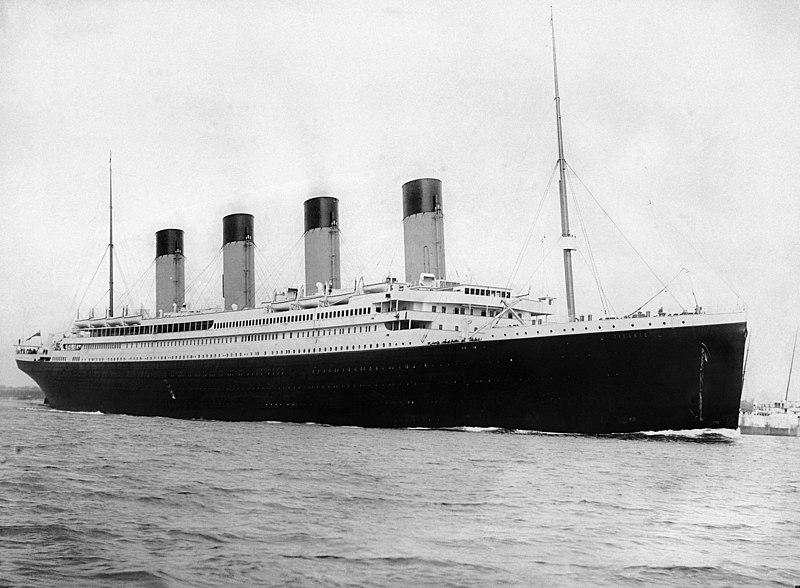
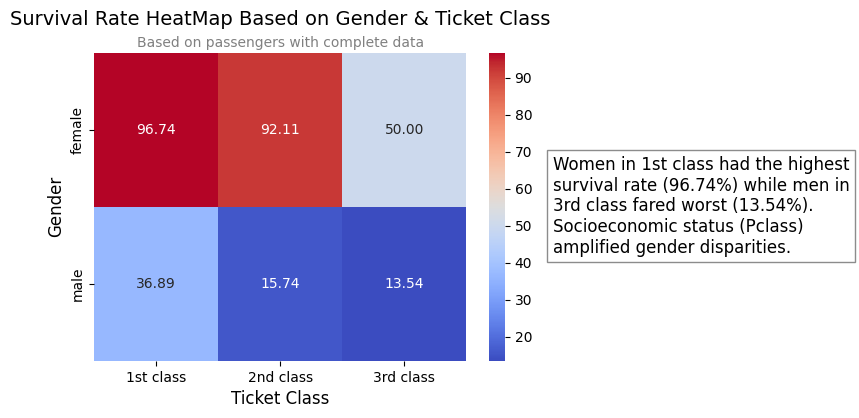

# Titanic Dataset Analysis
### Exploratory Data Analysis (EDA) of Passenger Survival Patterns

  

## 📌 Overview
This project analyzes the Titanic dataset (using only the training data) to uncover insights about passenger survival rates based on factors like age, gender, and class. Built with Python (pandas, seaborn, matplotlib), it focuses on non-machine learning EDA to highlight key trends through visualizations and statistics.
## 🔍 Data Note
⚠️ <strong>Analysis Scope</strong>: This study uses only the training dataset (train.csv), not the test set, to ensure consistency in exploratory analysis. Future work could extend insights to the full dataset.
## 📊 Key Features
<strong>Data Source</strong>: Kaggle’s Titanic competition training data (train.csv).

<strong>Data Cleaning</strong>: Handled missing values in Age and Cabin columns.

<strong>Visualizations</strong>: Comparative histograms, survival rate bar plots, and correlation heatmaps.

## **📊 Key Visualization**  

  

  
